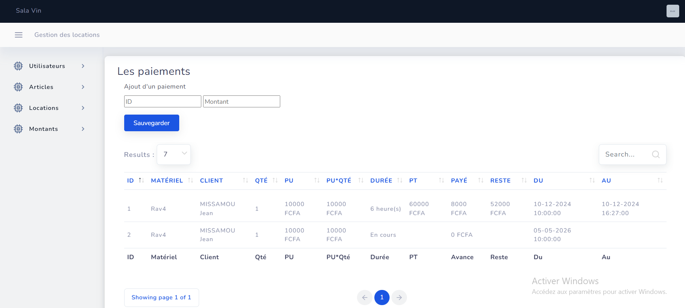

# 📦 LocaPro — Système de Location

> Application web complète de gestion de location d'équipements — voitures, chapiteaux, chaises, bureaux et plus — construite avec Laravel 11 et MySQL.


---



## ✦ Fonctionnalités

| Fonctionnalité | Description |
|---|---|
| 🗂 **Catalogue d'équipements** | Gestion complète du stock : voitures, chapiteaux, chaises, bureaux, tables, matériel audio-visuel et plus |
| 📅 **Réservations en ligne** | Calendrier interactif de disponibilité, création de devis et confirmation de réservation en temps réel |
| 📄 **Gestion des contrats** | Génération automatique de contrats PDF, signature électronique et archivage sécurisé |
| 💰 **Facturation & Paiements** | Factures automatiques, suivi des paiements, gestion des acomptes et relances automatiques |
| 📊 **Tableau de bord** | Statistiques en temps réel : taux d'occupation, chiffre d'affaires, équipements les plus demandés |
| 👥 **Multi-rôles** | Gestion des accès par rôle : administrateur, agent commercial et client avec espaces dédiés |

---

## ⚙ Stack technique

| Couche | Technologie | Version |
|---|---|---|
| Backend | Laravel | 8.x |
| Langage | PHP | 7.4+ |
| Base de données | MySQL | 8.0+ |
| Frontend | Blade + AdminLTE | — |
| Cache & Queues | Redis | — |
| UI Framework | Bootstrap | 5.x |

---

## ↯ Installation

### Prérequis

- PHP >= 7.4
- Composer
- MySQL >= 8.0
- Node.js >= 18 & npm
- Redis (optionnel, recommandé)

### Étapes

**1. Cloner le dépôt**

```bash
git clone https://github.com/votre-org/locapro.git
cd locapro
```

**2. Installer les dépendances**

```bash
composer install
npm install && npm run build
```

**3. Configurer l'environnement**

```bash
cp .env.example .env
php artisan key:generate
```

Modifier le fichier `.env` :

```env
DB_CONNECTION=mysql
DB_HOST=127.0.0.1
DB_PORT=3306
DB_DATABASE=locapro_db
DB_USERNAME=root
DB_PASSWORD=votre_mot_de_passe

REDIS_HOST=127.0.0.1
REDIS_PORT=6379

MAIL_MAILER=smtp
MAIL_HOST=smtp.mailtrap.io
MAIL_PORT=2525
```

**4. Migrations & Seeders**

```bash
php artisan migrate --seed
```

> Crée toutes les tables et insère les données de démonstration (équipements, utilisateurs, rôles).

**5. Lancer le serveur**

```bash
php artisan serve
# → http://localhost:8000
```

---

## ◈ Modules de l'application

### 🚗 Équipements
Gestion du catalogue complet de matériel disponible à la location :
- Voitures & véhicules utilitaires
- Chapiteaux & tentes événementielles
- Chaises, tables & mobilier
- Bureaux & équipements de bureau
- Matériel audio-visuel (sono, écrans, micros)
- Podiums & estrades
- Groupes électrogènes / générateurs

### 📅 Réservations
- Calendrier de disponibilité en temps réel
- Création et validation de devis
- Confirmations & notifications automatiques
- Gestion des annulations avec politique de remboursement
- Historique complet par client

### 📄 Contrats & Documents
- Génération automatique de contrats PDF
- Bons de livraison & bons de retour
- Procès-verbal de remise en état
- Archivage numérique des documents

### 💰 Facturation
- Factures pro forma et définitives
- Gestion des acomptes et soldes
- Suivi des paiements (espèces, virement, mobile money)
- Émission d'avoirs
- Export comptable

### 👤 Clients & CRM
- Fiches client complètes
- Historique des locations
- Programme de fidélité
- Relances automatiques par email/SMS
- Statistiques par client

### 📊 Rapports
- Taux d'occupation par équipement
- Chiffre d'affaires mensuel & annuel
- Top équipements les plus loués
- Export Excel / CSV
- Alertes de maintenance préventive

---

## ⬡ Rôles & Accès

| Rôle | Permissions |
|---|---|
| 🔴 **Administrateur** | Accès complet — gestion des utilisateurs, configuration, rapports, suppression de données |
| 🔵 **Agent Commercial** | Création de réservations, gestion des contrats, suivi des paiements et du stock |
| 🟢 **Client** | Consultation du catalogue, demande de réservation en ligne, espace personnel et factures |

---

## ⌘ Commandes utiles

```bash
# Vider le cache
php artisan cache:clear && php artisan config:clear

# Lancer les queues (notifications, emails)
php artisan queue:work --queue=notifications,emails

# Générer les données de test
php artisan db:seed --class=DemoSeeder

# Exécuter les tests
php artisan test --coverage

# Optimiser pour la production
php artisan optimize
php artisan view:cache
php artisan route:cache
```

---

## 🗂 Structure du projet

```
locapro/
├── app/
│   ├── Http/
│   │   ├── Controllers/
│   │   │   ├── EquipementController.php
│   │   │   ├── ReservationController.php
│   │   │   ├── ContratController.php
│   │   │   ├── FactureController.php
│   │   │   └── ClientController.php
│   │   └── Middleware/
│   ├── Models/
│   │   ├── Equipement.php
│   │   ├── Reservation.php
│   │   ├── Contrat.php
│   │   ├── Facture.php
│   │   └── Client.php
│   └── Services/
├── database/
│   ├── migrations/
│   └── seeders/
├── resources/
│   └── views/
│       ├── equipements/
│       ├── reservations/
│       ├── contrats/
│       └── factures/
├── routes/
│   ├── web.php
│   └── api.php
└── tests/
```

---

## 🧪 Tests

```bash
# Tous les tests
php artisan test

# Tests avec couverture
php artisan test --coverage

# Un groupe spécifique
php artisan test --filter ReservationTest
```

---

## 🤝 Contribution

Les contributions sont les bienvenues ! Merci de :

1. Fork le projet
2. Créer une branche (`git checkout -b feature/ma-fonctionnalite`)
3. Committer vos changements (`git commit -m 'feat: ajout de X'`)
4. Pousser la branche (`git push origin feature/ma-fonctionnalite`)
5. Ouvrir une Pull Request

---

## 📄 Licence

Ce projet est sous licence **MIT**. Voir le fichier [LICENSE](LICENSE) pour plus de détails.

---

<p align="center">Développé par Vincent Gérard SALABANZI</p>
